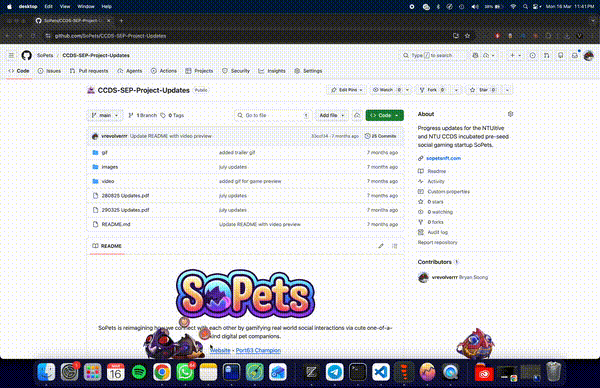
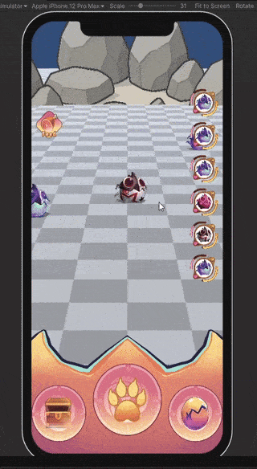
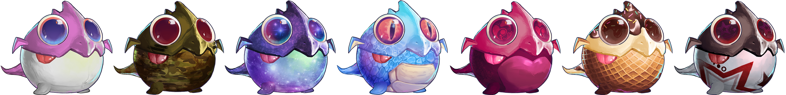
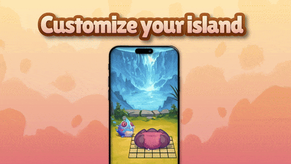

  
  
   
  
  SoPets is reimagining how we connect with each other by gamifying real world social interactions via cute one-of-a-kind digital pet companions.
  
  <small>
    <a href="https://www.sopetsofficial.com/">Website</a> • 
    <a href="https://www.ntu.edu.sg/i-lab/news-events/news/story-detail sep-team-sopets-took-home-1st-place-at-the-port63-hackathon-(web-3-theme)">Port63 Champion</a>
  </small>

---

## Project Information

### Team Composition

SoPets is built by a lean founding team with strong technical backgrounds, primarily composed of software engineers. The team is led by **Yue Hang (CEO)**, who drives product vision, strategy, and community direction; and **Soong Jun Shen (CTO)** who leads the technical team.

Given the product's heavy emphasis on emotional connection, storytelling, and character design, the team supplements its technical core by working with external creative talent. This includes artists and designers responsible for bringing SoPets' personalities and visual identity to life — an area identified as mission-critical to the product's success.

**Technical Team:**
- Tham Yao Xiang (NUS)
- Yong Jun Xi (NUS)
- Nicholas (NUS)

**Creative Team:**
- Chi (UI Lead)
- Charlette (NTU) (UX)
- Maxine (Illustrator)
- Stevie (Illustrator)
- Charmaine (NTU) (Illustrator)
- Angeline (Illustrator)

### Finance / Budget

The majority of costs are concentrated in two areas:
- **AI solutions**: tools used for asset generation, development acceleration, and experimentation with AI-driven interactions
- **Creative talent acquisition**: outsourcing and collaborating with artists and designers to build a compelling companion experience

### Start Date

28 September 2024

### Current Status

SoPets has completed its initial release and early validation phase. The project has built a community of 111 members, with an even higher number of downloads. Downloads are always open at [sopetsofficial.com/downloads](https://www.sopetsofficial.com/downloads).

### Awards

- Port63 Champions
- MDT Funded (NTUitive Incubated)

### Competitions

- VeChain Hackathon – 1st Runner Up
- Port63 – Champions

### Product News / Updates

- Attended NTU CCDS Homecoming
- [Port 63 Challenge Champion](https://www.ntu.edu.sg/innovates/news-events/port63#Content_C443_Col02)
- [SoPets attending SWITCH 2025](https://www.linkedin.com/posts/leeyuehang_i-was-afraid-that-sopets-would-be-out-of-activity-7390690878283165696-uaTu)
- [Reaching out to 100 people in NTU](https://www.linkedin.com/posts/leeyuehang_founderjourney-buildinpublic-sopets-activity-7389587817250635777-XK9T)

---

  <small>
    <strong>CCDS SEP Project Updates</strong>
  </small>

### Date: 13 March 2026

## Summary
Over the past few months, we have focused on polishing the SoPets desktop companion into a feature-rich experience. The desktop companion now includes a full breeding system, expanded pet collection with 10 skin variants, interactive petting mechanics, an experience levelling system, and engaging minigames — bringing us significantly closer to a complete and enjoyable user experience.

## Key Updates
- Polished the desktop companion with a full suite of features. View a video preview [HERE](video/130326-Desktop_Preview.mp4) | [YouTube](https://youtu.be/d1ePQ8s3ULo) | [YouTube](https://youtu.be/zfvkxovG1Q0).

- Implemented a full breeding experience within the desktop companion, allowing users to breed and discover new pet combinations.
- Expanded the pet collection to 10 unique skin variants, giving users more variety and collectibility.
- Added interactive petting mechanics for a more engaging and personal bond with the user's SoPet.
- Introduced an experience levelling system where pets grow and evolve through interaction and care.
- Built multiple minigames to keep the experience fun and replayable.
- General polish and refinements across the desktop companion for a smoother user experience.

### Upcoming Plans
- To continue refining and adding content to the desktop companion experience.
- To prepare for public launch and gather early user feedback.

---
### Date: 27 August 2025

## Summary
Over the past 3 months, we have made significant progress in terms of narrowing down our project scope, expanding our development team. We have finalised our project requirements and are laser focused on building a fully functional MVP to launch by early Q4' 2025. We have also made significant technical architectural changes and migrated our codebase into a completely new tech stack due to technical constraints we faced previously when building the proof-of-concept.

## Key Updates
- Rebuilt our entire infrastructure from the ground up with our frontend in Unity (C#) and the backend in SpacetimeDB, due to previous technological constraints. View a video preview [HERE](video/280825-Game_Preview.mp4)

- Introduced 6 new unique mix-and-match subvariants as part of the new collection system.

- Working on a new short feature trailer as part of our marketing and promotional plans. View the video [HERE](video/280825-SoPets_Trailer_WIP.mp4).

- Working on a new near proximity device detection technology using Bluetooth Low Energy and ultrasonic technologies for our tap-to-connect functionality.

- Updated our a [project website](https://www.sopetsofficial.com) with our latest updates and plans.

### Upcoming plans
- To complete the MVP version of SoPets with tap-to-connect and pet collection mechanics to gamify real world social interactions.
- Targeting to launch in early Q4' 2025, to validate our idea and get feedback from early users.

---
### Date: 29 March 2025

## Summary

SoPets is a digital companion app designed to create a meaningful, stress-free bond between players and their SoPet, emphasizing authentic pet care experiences. Over the past two months, we have made significant progress, designing and animating various pet nature styles with mix-and-match capabilities. We built a mobile MVP featuring core pet-rearing mechanics and demonstrated real-time multiplayer pet-sharing via Bluetooth and other technologies. Additionally, we developed a proof-of-concept for seamless native desktop integration, allowing SoPets to exist within the user’s workspace without disruption. To engage our audience, we also launched a project website to share updates and showcase our progress.

## Key Updates

- Designed and animated multiple pet nature designs and demonstrated the mix-and-match capabilities of the pets.
- Built a basic mobile application MVP that showcases basic pet-rearing features, and demonstrated the proof-of-concept for our online multiplayer pet-sharing mechanics, using Bluetooth and other realtime technologies.
  
  </img>

- Built the proof-of-concept of native desktop integration of our SoPet, where the digital pet can seamlessly exist within the bounds of the user's desktop, without interfering with the other windows.

  </img>

- Created a [project website](https://sopets.netlify.app/) to showcase SoPets, and to keep users updated on SoPet's progress.

  </img>
  
For a video presentation on the progress, visit [HERE](video/290325-SoPets_Video_Update.mp4).

https://github.com/user-attachments/assets/9b332041-cf77-4b76-a2da-b0ad8ed1c9a7

## Key Achievements

- Won 1st Place in the Web3 track for the [NTU Port63 Challenge AY24/25](https://www.ntu.edu.sg/innovates/port63#Content_C443_Col02), under the team name "Geek & Jeek".

### Upcoming Plans

- To develop the design for the scalable backend infrastructure for the SoPets ecosystem.
- To further refine the business plan and monetisation strategies.
- To implement the MVP for the SoPets desktop integration.
- To continue working on the pet rearing features on our mobile application, and integrate with our backend systems
